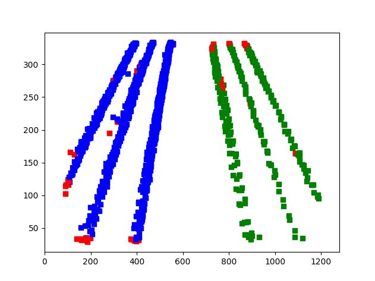

# Temalab22-23-1: Vehicle Tracking

Mivel a Git nem engedi hogy >100MB méretű filet pusholjak, ezért ahhoz hogy működjön, töltsd le ezt: https://pjreddie.com/media/files/yolov3.weights 

A sample.py fileban a model_file_path változó helyére írd be az előző .weights file elérési útját.

Tracking előtt:

Tracking és sebességmeghatározás után:

Le lett korlátozva a felismeréshez használható rész az alsó felére a képnek, hogy ne legyen olyan sok fals pozitív felismerés, amit egy frame után el is veszít. Az autók irányát színkódoltam: a felénk haladó zöld, az elfele haladó kék téglalapot kap.

Picit fejlettebb verziója:

Az autók irányának meghatározása az eddigiekhez képest semmit nem különbözik, csak pontatlanabb meghatározás ennyit számít. Eddig úgy volt kiszámolva hogy ha az előző pozíciótól felfele van akkor elfele halad, ha lefele van akkor meg felénk jön.  

Heatmap az elhaladó autókról, a sample3 file-on futtatva, rossz iránymeghatározási módszerrel:

Látszódik az ábrán is, hogy főleg a távolabbi régiókban sok zöld pont jelenik meg a kék pontok között, ez a fals meghatározás miatt van

Ez kijavítva: a legelső pozíciójához méri az irányt, nem az előzőhöz:

Itt már nincsenek az ábrán random zöld pontok a kék pontok között, ki lett javítva a hiba

## _TODO_
- GPU-ra kiszervezés, mert CPU-n lassú &rarr; próbáltam, nem tudom manuálisan buildelni hozzá az opencv-t 
- Sebesség meghatározása pontatlan &rarr; képlet mi?
- Egy-egy kihagyott framenél az autók id-je teljesen elvesznek, utána teljesen újat kapnak &rarr; javítani
